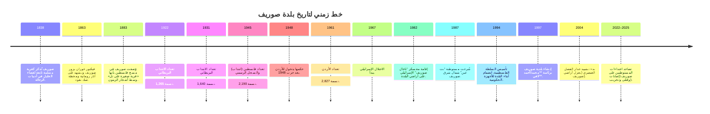

# ملخّص تنفيذي

تقع بلدة صوريف في شمال غرب محافظة الخليل بالضفة الغربية، على ارتفاع نحو 600 متر وعند تقاطع طرق فرعية تربطها بمحيطها. تبلغ مساحة أراضي صوريف حوالي **15,000 دونم** (حوالي 15 كلم²). تتبع صوريف إدارياً لمحافظة الخليل ولديها بلدية (منذ 1997) يقودها رئيس البلدية أحمد لافي. شهدت صوريف عبر تاريخها مدّات عمرانية متعاقبة من العهد العثماني إلى الانتداب البريطاني ثم الحكم الأردني وبعده الاحتلال الإسرائيلي منذ 1967. 

ازداد عدد سكان صوريف تزايداً متصاعداً خلال القرن العشرين والواحد والعشرين، حيث كان 1,265 نسمة عام 1922 ثم 17,287 نسمة حسب تعداد 2017. تعتمد اقتصاده أساساً على الزراعة والتصدّر لسوق العمل الإسرائيلي: 55% من السكان (2007) يعملون داخل إسرائيل، و40.7% من أراضي البلدة مزروعة. يصنف أكثر من 60% من السكان في الفئة العمرية 15-64 سنة. البنية التحتية للبلدة متوسطة: شبكات كهرباء ومياه معظَمها متوفرة، ولكنها تواجه تحديات في الصرف الصحي والمواصلات. 

تتعرّض صوريف لقيود الاحتلال الإسرائيلي في الحركة وإلى اعتداءات من مستوطنين مجاورين (مثل مستوطنة بت عين)، ما أدى إلى مصادرة أراضٍ (1,213 دونم منذ 2000) وبناء جدار الفصل (يسجن نحو 1,300 دونم خلفه). كما وثقت منظمات حقوقية هجمات مستوطنين على سكان صوريف وأراضيهم في السنوات الأخيرة (جرح وقتل مواطنين في 2022–2025). رغم ذلك تحافظ البلدة على مؤسساتها المحلية من بلدية وجمعيات أهلية (شبابية وخيرية وتعليمية)، وتعتني بثقافتها المحلية وتراثها الديني (مثل مقام الصحابي أبي عبيدة بخربة جمرين). الحاجة قائمة إلى تطوير بناها التحتية – كمدّ طرق إضافية وشبكات صحية وتعليمية – لتحسين أوضاع السكان المعيشية.

## الموقع والوضع الإداري

تقع صوريف في شمال غرب الخليل (25 كم شمال المدينة) وترتفع عن سطح البحر حوالي 600 متر. يحدها شمالاً بلدة الجبعة (قضاء بيت لحم)، جنوباً بيت أمر ومدينة حلحول، شرقاً بيت أمّر، وغرباً بلدات بيت نتيف وبيت شيمش بالقدس المحتلة. تُصنّف صوريف إدارياً “مدينة” (نوع أ) حسب المعيار الفلسطيني، وترأس بلديتها (تأسست 1997) حالياً **أحمد علي لافي**. البلدية مسؤولة عن الخدمات المحلية، كما توجد جمعيات ومؤسسات أهلية تنشط في البلدة (جمعية شباب صوريف، جمعية رعاية الأيتام، نادي شباب رياضي، جمعية سيدات وصيف… وغيرها). 

(**خريطة**: تضمّن صوريف أراضي زراعية واسعة، وبنيتها العمرانية الرئيسية تقع مركزاً على رأس تل مثلث الأضلاع؛ مع غابات ووديان من حولها. الصورة أدناه تظهر تلال صوريف ومزارعها الزراعية الخضراء.)  

 *صورة بانورامية لبلدة صوريف وأراضيها الزراعية المحيطة (مصدر: موسوعة القرى الفلسطينية).*

## التاريخ والزمن

نشأت صوريف منذ العصور الإسلامية المتأخرة، وربما كان لها وجود في العصر الروماني (يذكر لها اسم سرياني “سريفا” أو “سوار الريف”). قبيل الحكم العثماني، سجل الرحالة روبنسون عام 1838 صوريف كقرية صغيرة تابعة لقضاء الخليل. زارها الرحالة الفرنسي فيكتور جويران عام 1863 ولاحظ وجود محال لصكِّ النقود الرومانية وبئر قديم، وذكر وجود حوالي 700 نسمة وقتها. في عام 1870 سجلت المصادر العثمانية البلدة تضم 87 منزلاً و265 رجلاً، وفي مسح جمعية استكشاف فلسطين (1883) وُصفت بأنها «قرية صغيرة على تل منخفض، تحيط بها أشجار الزيتون من الجنوب». بنهاية القرن التاسع عشر بلغت تقديرات عدد السكان نحو 1,164 نسمة.

خلال الانتداب البريطاني (1917-1948) زاد عدد سكان صوريف، فمن 1,265 عام 1922 إلى 1,640 عام 1931 (جميعهم مسلمون)، ثم إلى 2,190 عام 1945. في الإحصاء الأردني عام 1961 (بعد حرب 1948) كان عدد سكانها 2,827. بعد حرب 1967 أصبحت صوريف تحت الاحتلال الإسرائيلي. خلال الاحتلال شهدت البلدة مصادرة أجزاء من أراضيها: مثلاً منذ انتفاضة الأقصى (2000) تم مصادرة حوالي **1,213 دونماً** من أراضي صوريف. بدء بناء جدار الفصل العنصري في عام 2004 عزل نحو **1,300 دونم** من أراضي صوريف خلفه. 

في 1982 أقامت إسرائيل معسكراً عسكرياً («ناحال صوريف») في أراضي البلدة ثم تحوّل إلى منطقة سكنية بعد التسعينات. عام 1987 شُرعت بناء مستوطنة «بت عين» على أراضٍ شمال شرق صوريف. مع تأسيس السلطة الفلسطينية (1994) تحولت صوريف لإدارتها المدنية، وأقيمت البلدية عام 1997. في الأعوام الأخيرة ازدادت اعتداءات المستوطنين على البلدة، من قِبل مستوطني «بت عين» المجاورة؛ ففي فبراير 2025 أصيب فلسطيني بجروح في اعتداء مستوطنين على بلدة صوريف، وفي يونيو 2025 قتل مستوطن فلسطينيًا برصاصهم شمال صوريف. 

## التركيبة السكانية

شهدت صوريف نمواً سكانياً واضحاً. انظر الجدول أدناه للتعدادات التاريخية:  

| السنة (م) | عدد السكان | المصدر |
|---|---|---|
| 1922 | 1,265 | تعداد بريطاني |
| 1931 | 1,640 | تعداد بريطاني |
| 1945 | 2,190 | تعداد بريطاني |
| 1961 | 2,827 | تعداد أردني |
| 1997 | 9,649 | تعداد فلسطيني |
| 2007 | 13,365 | تعداد فلسطيني |
| 2017 | 17,287 | تعداد فلسطيني |
| 2021 | 19,013 (تقديري) | تقدير حديث |

حسب تعداد 2007 بلغ عدد سكان البلدة حوالي 13.4 ألف نسمة، وتوزعوا بالتساوي تقريبا بين ذكور وإناث (6,748 vs 6,617). وتشكل الفئة العمرية (15-64 سنة) نحو 55.1% من السكان، وفئة الأطفال (0-14) نحو 41.2%. تبلغ نسبة الأميين نحو 5.6% (أغلبيتهم من النساء)، ونحو 16% من السكان حائزون شهادة ثانوية فما فوق. معظم سكان صوريف من الفلسطينيين والمسلمين، وقليلة هم العائلات التي تعيش حالة لاجئ فلسطيني، إذ لا يوجد مخيم أو تجمع رسمي للاجئين في البلدة. 

يتألف المجتمع المحلي من عدة عشائر وعائلات بارزة؛ ومن الأعلام المحليين الذين ذُكروا: إبراهيم أبو دية الغنيمات، غازي إنعيم، شريف عدنان، وموسى غنيمات. تسهم العائلات الكبيرة في الحياة الاجتماعية للمجتمع، خاصة عائلة **الغنيمات** التي ينتمي إليها بعض الشخصيات التاريخية.

## الاقتصاد والأنشطة الاقتصادية

يعتمد اقتصاد صوريف إلى حد كبير على الزراعة والعمالة في سوق العمل الإسرائيلي. تتركز الزراعة في زراعة الزيتون (حوالي 6,035 دونم زراعة بعلية من الزيتون)، بالإضافة إلى الحبوب (يُزرع 1,120 دونمًا من القمح والشعير) ومحاصيل البقوليات والتين والفواكه الصغيرة. الجدول التالي يوضح توزيع استخدامات الأرض رئيسياً (2006):

| نوع الاستخدام        | مساحة (دونم) |
|--------------------|-----------------------------|
| إجمالي مساحة البلدة      | 31,600 دونم |
| أراضٍ صالحة للزراعة (كلّي) | 13,500 دونم تقريبًا |
| أراضي مزروعة حاليا     | 8,457 دونم |
| أراضٍ بور غير مزروعة   | 5,043 دونم |
| مناطق معمارية (بنايات)  | 8,000 دونم |
| غابات ومساحات خضراء    | 400 دونم |
| أراضٍ أخرى ورعاة      | 9,700 دونم |

*الحصاد الزراعي*: الزيتون المحصول الأكثر أهمية، إلى جانب الحبوب (قمح وشعير) والخضروات البعلية والفاكهة. يساهم النشاط الزراعي بنحو 40.7% من دخل البلدة، وتشكل الزراعة 20% من اليد العاملة وفق إحصاء 2007. 

من جهة أخرى، يعتمد نحو نصف السكان على العمل داخل إسرائيل (في المستوطنات أو المدن الإسرائيلية)، ما يعني أن أكثر من 50% من السكان يقتاتون من وظائف في الاقتصاد الإسرائيلي. أما باقي القوى العاملة فتعمل في التجارة والقطاع الخدمي (حوالي 12% مجتمعة)، والصناعة المحلية (حوالي 3%). هناك تجمع صناعي صغير في البلدة يضم مقالع حجر، مخابز، مشاغل حدادة ونجارة، معصرتي زيتون، وبعض الورش الحرفية. كما توجد مؤسستان استهلاكيتان رئيسيتان («مؤسسة الزيتونة» و«جمعية صوريف التعاونية») تقومان بتأمين بعض الخدمات التجارية للسكان. 

معدلات البطالة في صوريف عالية نسبياً؛ فقد بلغت نحو 40% من القوى العاملة عام 2007. تأثر الاقتصاد المحلي سلباً بإجراءات الاحتلال خلال الانتفاضة الثانية، حيث فقد كثير من العمال وظائفهم الإسرائيلية وجزء من الأراضي الزراعية. 

## استخدامات الأرض والمساحة

مساحة أراضي صوريف الإجمالية تقارب 31,600 دونم (31.6 كم²). تظهر الصور والمسح أن البلدة تمتد فوق سلسلة جبلية محاطة بوهادٍ زراعية. وفقا لوزارة الزراعة الفلسطينية، فإن أراضي صوريف تشمل نحو 8,457 دونم مزروعة و5,043 دونم بور من أصل 31,600. تقدر المساحة المبنية بـ8,000 دونم (تشمل المنطقة القديمة والمناطق الجديدة)، وهناك 400 دونم غابات.

يهيمن على مساحة البلدة الزراعة والغابات والمراعي. الأرض الزراعية موزّعة بين بساتين الزيتون والتين والعنب، ومناطق الحبوب البعلية. كما خصصت البلدة بعض المساحات للسكن والبناء. بناء جدار الفصل العنصري غرباً عزل حوالي 1,300 دونم من أراضي البلدة خلف الساتر الأمني، وامتدت حول صوريف مستوطنات مثل كفار عتصيون جنوباً (محاط بجدار الفصل)، و«بت عين» شمال شرقاً. 

## البنية التحتية والخدمات

**المواصلات والطرق:** تشكل شبكة طرق صوريف حوالي 86.3 كم، منها 39 كم معبدة بحالة جيدة و5.9 كم معبدة قديمة بحاجة لإصلاح، والباقي طرق ترابية (حوالي 41.4 كم). الطرق الرئيسية (عرضها ~3.5-3.7 م) تربط البلدة بمدينة حلحول والطرق الفرعية. المواصلات العامة قليلة: يوجد حوالي 6 حافلات و22 تاكسي تعمل بين البلدة والقرى والمدن المجاورة.

**المياه والكهرباء:** شبكات المياه والصرف الصحي متاحة جزئياً. البلدة متصلة بشبكة مياه عامة (شركة المياه الإسرائيلية “مكوروت”) منذ 1973، ويتوفر الماء لحوالي 95% من الوحدات السكنية. هناك أيضًا ستّة ينابيع محلية للأغراض الزراعية، وخزان ماء سعته 140 م³. ومع ذلك يواجه السكان عجزاً في توصيل المياه لأعلى البلدة بسبب ضغط الشبكة وحجم الخزان المحدود. الكهرباء موصّلة إلى البلدة منذ 1993، وحوالي 93% من المنازل متصل بالطاقة، وتوزعها البلدية عبر شركة الكهرباء الإسرائيلية. بعض المناطق تعاني من ضعف في التيار الكهربائي أو انقطاعات عرضية.

**الصرف الصحي والنفايات:** لا توجد شبكات صرف صحي مركزية؛ يُسقى المجاري في الحفر (بيارات) مما يتسبب بتلويث المياه الجوفية في بعض الأحيان. إضافة إلى ذلك، تعاني جزء شمال صوريف من تصريف مياه الصرف الصحي القادمة من مستوطنة كفار عتصيون المجاورة. تنظم بلدية صوريف جمع النفايات الصلبة يومياً عبر شاحنة قمامة مشتركة مع مجلس الخدمات المشترك شمال غرب الخليل، ويتم التخلص منها برمي الحرق في مقالع نائية. 

**الاتصالات:** البلدة مرتبطة بشبكة هاتف ثابت وتبلغ نسبة توصيل الهاتف نحو 50% من المنازل. وسائل الإعلام المحلية متوفرة (فضائيات وراديو)، وبدأت تغطية الهاتف المتنقل فيما بعد (جوالات). 

**التعليم:** تضم صوريف مرحلتي التعليم الأساسي والثانوي. بلغ إجمالي عدد المدارس في 2007 تسع مدارس (خمسة للذكور وثلاثة للإناث ومدرسة مختلطة خاصة). المدارس الحكومية (ذكور وإناث) يديرها وزير التربية والتعليم، ويوجد مدرستان ابتدائيتان تابعان للأونروا وتستضيفان أبناء الأسر الفلسطينية ذات الوضع الخاص. إجمالي الصفوف يبلغ حوالي 72 صفاً، ويعمل في المدارس المئات من المعلمين. يلتحق معظم الأطفال بالدراسة حتى الثانوية، وتراجع نسبة الأمية إلى ~5.6% (2007).

**الصحة:** القطاع الصحي في صوريف يضم مراكز طبية حكومية وخاصة. يوجد مركز صحي حكومي أساسي (لقاح وتغذية الأمهات والأطفال) ومختبر طبي تابع للوزارة. كما تحتوي البلدة على عيادة خاصة كبيرة («مركز سمير الطبي») ومعمل خاص، و7 عيادات خصوصية و3 عيادات أسنان خاصة بالإضافة إلى مركز صحي خيري. فضلاً عن ذلك، هناك 5 صيدليات في البلدة. رغم ذلك، يشكو السكان من ضعف الوصول إلى المستشفيات الكبرى في الحالات الطارئة. توفر هذه المؤسسات الرعاية الأولية الأساسية، لكن الاحتياجات كبيرة بزيادة تجهيز العيادات وبناء مركز صحي شامل لتخفيف الاعتماد على مستشفيات المدن الأخرى.

## الحكم المحلي والمؤسسات

منذ تأسيس بلدية صوريف عام 1997، تتولى هذه الجهة الخدمات البلدية والإدارية. يتكون المجلس البلدي من أعضاء منتخبين، ويترأسه حالياً أحمد لافي. البلدية مسؤولة عن تخطيط البناء وجمع النفايات وتشغيل بعض الخدمات. على الصعيد المحلي، توجد جمعيات أهلية نشطة تشمل جمعية «شباب صوريف الخيرية» (تأسست 1964)، والجمعية الإسلامية للشباب (1999)، وجمعية رعاية الأيتام (1984)، وجمعية سيدات صوريف (1976)، ونادي شباب صوريف الرياضي (1998). تعمل هذه الجمعيات على تنظيم البرامج الثقافية والاجتماعية ودعم العائلات المحتاجة وتنمية الشباب. كذلك توجد لجنة نسائية تقدم دورات وبرامج للنساء. لا توجد مؤسسات حكومية مركزية في البلدة إلا مكتب بريد واحد.

## الثقافة والمجتمع

يشتهر سكان صوريف بالعادات الفلسطينية التقليدية في الزراعة وفنون الحرف اليدوية. من أبرز المعالم الثقافية والدينية بالبلدة: **المسجد العمري الكبير** (بني عام 1945م وتم توسعته عام 1970)، ومقام الصحابي **أبو عبيدة عامر بن الجراح** في خربة جمرين جنوب البلدة، بالإضافة إلى بقايا البلدة القديمة (548 مبنى عمراني قديم فوق 400 عام). كما تشتهر البلدة بنسيج مفروشات (مزاود) وأعمال حرفية محلية؛ فبعض السكان يعملون في صناعة السجاد والمزاود ومنتجات الألبان.  

تُمارس صوريف الفلكلور الشعبي الفلسطيني من حيث الموروثات (زغاريت، وأناشيد وطنية في المناسبات الوطنية والدينية). تتمتع البلدة ببعض المناسبات الموروثة مثل مهرجان الزيتون المحلي السنوي (حصاد الزيتون) وأماكن الاحتفال المتميزة (مسجد قديم ومناطق أثرية). كما تبرز المشاهد الاجتماعية في تجمعات العائلات الكبيرة في المناسبات؛ من أبرز العوائل في صوريف عائلة الغنيمات التي لعب أفرادها أدواراً سياسية وفدائية في تاريخ المنطقة.  

لا توجد حفلات أو مهرجانات رسمية كبرى، لكن يلتقي الأهالي في ساحة البلدية أو دور العبادة لإحياء الأعياد الدينية (رمضان، الأضحى) والأعراس الفلسطينية التقليدية.

## التعليم والإحصاءات الصحية

يمثل مستوى التعليم في صوريف تطوراً ملحوظاً. نسبة الإلمام بالقراءة والكتابة عالية (نسبة الأمية 5.6% فقط عام 2007). عدد الطلاب في المدارس الابتدائية والثانوية تجاوز 4,000 طالب عام 2007. توجه البلدة حالياً لبناء مدرسة ابتدائية جديدة للبنين ورصف صفوف قائمة متهالكة. بالرغم من وجود مدارس حكومية ومساندة، يضطر بعض الطلاب للتنقل خارج البلدة لاكتمال بعض المراحل أو لاعتبارات أكاديمية.  

في الصحة العامة، لا تتوفر أرقام محلية محدّثة عن معدلات وفيات الرضع أو متوسط الأعمار، لكن الظروف الصحية محكومة بحد الأدنى من المرافق. نسبة التغطية بالخدمات الصحية الأساسية غير كاملة بسبب صعوبة التنقل والحصار؛ حيث يواجه سكان الصوريف صعوبات في الوصول إلى المستشفيات الخارجية في حالات الطوارئ. أبلغ السكان عن نقص في الأسرة والمعدات داخل المركز الصحي المحلي، ويطالبون بتجهيزه بشكل أفضل. 

## الأمن وتأثير الاحتلال

منذ العام 1967 تتعرض صوريف لقيود الاحتلال الإسرائيلي. تحيط بها مستوطنتان رئيسيتان: كفار عتصيون جنوباً (على بعد كيلومترات) ومستوطنة «بت عين» شمال شرقها. بعد انتفاضة الأقصى، خضعت صوريف لمصادرة أراضي واسعة: فقد صادرت إسرائيل 1,213 دونماً من أراضي البلدة منذ عام 2000. ويجري بناء جدار الفصل غرباً وفي الشمال، حيث يعزل نحو 1,300 دونم من أراضي صوريف خلفه بمجرد استكماله. 

يوجد لصوريف نقطة تفتيش دائمة (دائم الخطر) واحدة، وثلاث نقاط عسكرية متحركة، وعوائق عسكرية (بوابات حديدية) من اتجاهات عدة. تعيق هذه الحواجز حركة السكان والزوار: فهي تجعل الوصول لمراكز الرعاية الصحية والمدارس والمزارع صعباً، وتغلق الطرق في أوقات غير محددة. كما يُضطر بعض المزارعين للحصول على تصاريح عسكرية لدخول أراضيهم المحاذية للمستوطنات. 

كما وثقت منظمات حقوقية عديدة حالات اعتداء من مستوطنين على أهالي صوريف أو ممتلكاتهم. ففي إبريل 2022 قام مستوطنون بدعم الجيش بإطلاق النار على مزارعين من صوريف أثناء محاولتهم إزالة حاجز على طريق زراعي، مما أسفر عن إصابات. وفي فبراير 2025 تعرض مزارع من البلدة للضرب والإصابة وجهازيه بعدما اقتحم مستوطنون أرضه وحطموا بيوت زراعية. وفي 19 حزيران 2025 فتح مستوطنون من «بت عين» النار على مجموعة من أهالي صوريف مما أدى إلى مقتل شاب وجرح ثلاثة آخرين. تأتي هذه الاعتداءات ضمن تصاعد العنف الاستيطاني في المنطقة. تعكس هذه الأحداث تداعيات الاحتلال على صوريف: تهديد أمن السكان وسلب قوتهم من الأرض وزعزعة الاستقرار الاجتماعي.

## المشاريع التنموية والاحتياجات

تسعى بلدية صوريف ومنظمات دولية إلى تطوير المدينة وتحسين بنيتها التحتية. وكشف مسح بلدي لحاجات البلدة أن الأولويات التطويرية تشمل: **مدّ طرق معبدة إضافية (نحو 35 كم)** لتغطية أنحاء البلدة، **تحسين شبكات المياه** (إنشاء شبكات جديدة وإصلاح القدام منها لمسافة تقارب 32 كم)، وتعزيز قدرات مياه الشرب. كما يُعتبر إنشاء مركز صحي متكامل (عيادة طبية جديدة) أمراً ملحاً، إضافة إلى بناء مدرسة ابتدائية جديدة للبنين وتأهيل مدارس قائمة. في المجال الزراعي، تركز الاحتياجات على ترميم نحو 8,000 دونم من الأراضي وجدرانها الترابية وبناء خزانات خزن مياه وصدور للمواشي. تسعى كذلك المشاريع إلى توفير فرص تشغيل وتنمية اقتصادية (مثل تشجيع التعاونيات الزراعية أو إنشاء مشروعات صغيرة) لمعالجة البطالة المرتفعة.

حاليا تنفذ بعض المنظمات المشروعات الصغرى في البلدة (كمعالجة المياه وتحسين الري)، لكن تحديات التمويل والإجراءات الإسرائيلية تعيق الوتيرة. يؤكد أهالي صوريف على ضرورة استكمال بناء مرافق الصرف الصحي (شبكة صرف متكاملة) وجلب طاقة جديدة لضخ المياه إلى مناطق التلال، بالإضافة إلى دعم القطاع الصحي والتعليم بموارد أكبر. 

## المصادر

راجع التقرير أعلاه المصادر التالية لكل معلومة وردت: البيانات الرسمية والجداول مأخوذة من إحصاءات الجهاز المركزي الفلسطيني (PCBS) وتعدادات رسمية، والمسح السكاني (Palestine Remembered). معلومات تاريخية من مصادر موثوقة كالمسوحات الاستكشافية القديمة. بيانات الزراعة والاستخدامات الأرضية من وزارة الزراعة الفلسطينية. معلومات البنى التحتية والخدمات من دراسة (ARIJ). الأحداث الأمنية والاستيطانية موثقة بتقارير أونروا ومنظمات حقوق الإنسان. المراجع العربية استُكملت من موسوعة القرى الفلسطينية. 