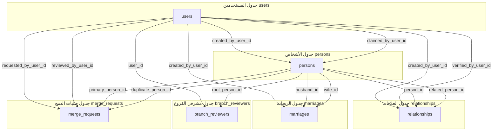

# مخطط علاقات الكيانات (ERD)
# Entity Relationship Diagram
## منصة شجرة العائلة الكبرى — Crowdsourced Grand Family Tree Platform

---

| البند            | التفاصيل                                              |
|------------------|-------------------------------------------------------|
| **الإصدار**      | 2.0 — موثق من الكود الفعلي (Post-Implementation)      |
| **تاريخ التوثيق**| 2026-07-30                                            |
| **ORM**          | Drizzle ORM v0.45.2                                   |
| **قاعدة البيانات**| PostgreSQL (محلي أو Supabase)                         |
| **ملف المخطط**   | `src/db/schema.ts`                                    |

---

## 1. مخطط ER بصيغة Mermaid

```mermaid
erDiagram
    USERS {
        bigserial id PK "المعرف الفريد"
        varchar(255) email UK "البريد الإلكتروني - فريد"
        text password_hash "كلمة المرور المشفرة (اختياري)"
        varchar(255) full_name "الاسم الكامل"
        varchar(50) phone "رقم الهاتف (اختياري)"
        varchar(20) role "الدور: USER | REVIEWER | ADMIN"
        timestamp created_at "تاريخ الإنشاء"
    }

    PERSONS {
        bigserial id PK "المعرف الفريد"
        varchar(100) first_name "الاسم الأول (إلزامي)"
        varchar(100) father_name "اسم الأب"
        varchar(100) grand_father_name "اسم الجد"
        varchar(100) family_name "اسم العائلة"
        varchar(10) gender "الجنس: MALE | FEMALE"
        boolean is_alive "حالة الحياة (افتراضي: true)"
        integer birth_year "سنة الميلاد"
        varchar(20) death_date "تاريخ الوفاة"
        varchar(255) burial_place "مكان الدفن"
        text photo_url "رابط الصورة أو Base64"
        text biography "السيرة الذاتية"
        boolean is_placeholder "عقدة مؤقتة تلقائية (افتراضي: false)"
        bigint created_by_user_id FK "المستخدم المُنشئ"
        bigint claimed_by_user_id FK-UK "المستخدم المُطالب (فريد)"
        timestamp created_at "تاريخ الإنشاء"
    }

    RELATIONSHIPS {
        bigserial id PK "المعرف الفريد"
        bigint person_id FK "الشخص الأول (الطرف المصدر)"
        bigint related_person_id FK "الشخص الثاني (الطرف الهدف)"
        varchar(20) relationship_type "نوع العلاقة: PARENT | CHILD | SPOUSE"
        varchar(20) status "الحالة: PENDING | VERIFIED | REJECTED"
        bigint created_by_user_id FK "مُنشئ العلاقة"
        bigint verified_by_user_id FK "المراجع المُعتمد"
        timestamp verified_at "تاريخ الاعتماد"
        timestamp created_at "تاريخ الإنشاء"
    }

    MARRIAGES {
        bigserial id PK "المعرف الفريد"
        bigint husband_id FK "معرف الزوج (إلزامي)"
        bigint wife_id FK "معرف الزوجة (اختياري - إن كانت في الشجرة)"
        varchar(255) external_spouse_name "اسم الزوجة الخارجية"
        varchar(255) external_family_name "اسم عائلة الزوجة الخارجية"
        varchar(50) status "الحالة: ACTIVE | DIVORCED | DECEASED"
        integer marriage_order "ترتيب الزواج (افتراضي: 1)"
        bigint created_by_user_id FK "المستخدم المُسجل"
        timestamp created_at "تاريخ الإنشاء"
    }

    BRANCH_REVIEWERS {
        bigserial id PK "المعرف الفريد"
        bigint user_id FK "معرف المستخدم المشرف"
        bigint root_person_id FK "معرف الشخص الجذري للفرع"
        timestamp assigned_at "تاريخ التعيين"
    }

    MERGE_REQUESTS {
        bigserial id PK "المعرف الفريد"
        bigint primary_person_id FK "معرف السجل الأساسي"
        bigint duplicate_person_id FK "معرف السجل المكرر"
        varchar(20) status "الحالة: PENDING | APPROVED | REJECTED"
        bigint requested_by_user_id FK "مقدم طلب الدمج"
        bigint reviewed_by_user_id FK "المراجع المنفذ"
        timestamp created_at "تاريخ الإنشاء"
    }

    %% === العلاقات بين الجداول ===

    USERS ||--o{ PERSONS : "created_by_user_id (أنشأ)"
    USERS ||--o| PERSONS : "claimed_by_user_id (طالب بملفه)"

    PERSONS ||--o{ RELATIONSHIPS : "person_id (طرف مصدر)"
    PERSONS ||--o{ RELATIONSHIPS : "related_person_id (طرف هدف)"
    USERS ||--o{ RELATIONSHIPS : "created_by_user_id (أنشأ العلاقة)"
    USERS ||--o{ RELATIONSHIPS : "verified_by_user_id (اعتمد العلاقة)"

    PERSONS ||--o{ MARRIAGES : "husband_id (الزوج)"
    PERSONS ||--o{ MARRIAGES : "wife_id (الزوجة)"
    USERS ||--o{ MARRIAGES : "created_by_user_id (سجّل الزواج)"

    USERS ||--o{ BRANCH_REVIEWERS : "user_id (المشرف)"
    PERSONS ||--o{ BRANCH_REVIEWERS : "root_person_id (جذر الفرع)"

    PERSONS ||--o{ MERGE_REQUESTS : "primary_person_id (السجل الأساسي)"
    PERSONS ||--o{ MERGE_REQUESTS : "duplicate_person_id (السجل المكرر)"
    USERS ||--o{ MERGE_REQUESTS : "requested_by_user_id (مقدم الطلب)"
    USERS ||--o{ MERGE_REQUESTS : "reviewed_by_user_id (المراجع)"
```

---

## 2. وصف تفصيلي للكيانات (Entity Descriptions)

### 2.1 جدول المستخدمين (`users`)

| العمود | النوع | القيود | الوصف |
|--------|-------|--------|-------|
| `id` | `bigserial` | PK, AUTO_INCREMENT | المعرف الفريد التسلسلي |
| `email` | `varchar(255)` | UNIQUE, NOT NULL | البريد الإلكتروني — يُستخدم كمعرف تسجيل الدخول |
| `password_hash` | `text` | NULLABLE | كلمة المرور المشفرة (مُستخدم مع Supabase Auth) |
| `full_name` | `varchar(255)` | NOT NULL | الاسم الكامل للمستخدم |
| `phone` | `varchar(50)` | NULLABLE | رقم الهاتف |
| `role` | `varchar(20)` | NOT NULL, DEFAULT `'USER'` | الدور: `USER` \| `REVIEWER` \| `ADMIN` |
| `created_at` | `timestamptz` | DEFAULT `now()` | تاريخ إنشاء الحساب |

**القيود الإضافية:**
- `UNIQUE(email)` — لا يمكن تكرار البريد الإلكتروني

---

### 2.2 جدول الأشخاص (`persons`)

| العمود | النوع | القيود | الوصف |
|--------|-------|--------|-------|
| `id` | `bigserial` | PK, AUTO_INCREMENT | المعرف الفريد |
| `first_name` | `varchar(100)` | NOT NULL | الاسم الأول |
| `father_name` | `varchar(100)` | NULLABLE | اسم الأب |
| `grand_father_name` | `varchar(100)` | NULLABLE | اسم الجد |
| `family_name` | `varchar(100)` | NULLABLE | اسم العائلة / القبيلة |
| `gender` | `varchar(10)` | NOT NULL | الجنس: `MALE` أو `FEMALE` |
| `is_alive` | `boolean` | NOT NULL, DEFAULT `true` | حالة الحياة |
| `birth_year` | `integer` | NULLABLE | سنة الميلاد |
| `death_date` | `varchar(20)` | NULLABLE | تاريخ الوفاة (نص: `YYYY-MM-DD` أو `YYYY`) |
| `burial_place` | `varchar(255)` | NULLABLE | مكان الدفن / الوفاة |
| `photo_url` | `text` | NULLABLE | رابط الصورة (URL أو Base64 Data URI) |
| `biography` | `text` | NULLABLE | السيرة الذاتية |
| `is_placeholder` | `boolean` | DEFAULT `false` | عقدة والد مؤقتة أُنشئت تلقائياً عند ربط الإخوة |
| `created_by_user_id` | `bigint` | FK → `users.id`, ON DELETE SET NULL | المستخدم الذي أنشأ هذا السجل |
| `claimed_by_user_id` | `bigint` | FK → `users.id`, ON DELETE SET NULL, UNIQUE | المستخدم الذي طالب بهذا الملف |
| `created_at` | `timestamptz` | DEFAULT `now()` | تاريخ إنشاء السجل |

**القيود الإضافية:**
- `UNIQUE(claimed_by_user_id)` — كل مستخدم يمكنه المطالبة بملف واحد فقط
- `FK(created_by_user_id)` → `users.id` ON DELETE SET NULL
- `FK(claimed_by_user_id)` → `users.id` ON DELETE SET NULL

---

### 2.3 جدول العلاقات (`relationships`)

| العمود | النوع | القيود | الوصف |
|--------|-------|--------|-------|
| `id` | `bigserial` | PK | المعرف الفريد |
| `person_id` | `bigint` | NOT NULL, FK → `persons.id` | الطرف المصدر في العلاقة |
| `related_person_id` | `bigint` | NOT NULL, FK → `persons.id` | الطرف الهدف في العلاقة |
| `relationship_type` | `varchar(20)` | NOT NULL | نوع العلاقة: `PARENT` \| `CHILD` \| `SPOUSE` |
| `status` | `varchar(20)` | NOT NULL, DEFAULT `'PENDING'` | حالة العلاقة: `PENDING` \| `VERIFIED` \| `REJECTED` |
| `created_by_user_id` | `bigint` | FK → `users.id` | المستخدم الذي أنشأ العلاقة |
| `verified_by_user_id` | `bigint` | FK → `users.id` | المراجع الذي اعتمد العلاقة |
| `verified_at` | `timestamptz` | NULLABLE | تاريخ ووقت الاعتماد |
| `created_at` | `timestamptz` | DEFAULT `now()` | تاريخ إنشاء العلاقة |

**القيود الإضافية:**
- `FK(person_id)` → `persons.id` ON DELETE CASCADE
- `FK(related_person_id)` → `persons.id` ON DELETE CASCADE
- `FK(created_by_user_id)` → `users.id` ON DELETE SET NULL
- `FK(verified_by_user_id)` → `users.id` ON DELETE SET NULL

**دلالات relationship_type:**
| النوع | الدلالة | person_id | related_person_id |
|-------|---------|-----------|-------------------|
| `PARENT` | علاقة أبوة | **الابن/الابنة** | **الأب/الأم** |
| `CHILD` | علاقة بنوة | **الأب/الأم** | **الابن/الابنة** |
| `SPOUSE` | علاقة زوجية | الزوج الأول | الزوج الثاني |

> **ملاحظة مهمة:** في نوع `PARENT`، الحقل `person_id` يمثل **الابن** و `related_person_id` يمثل **الأب**. هذا معكوس بديهياً ومهم لفهم تدفق البيانات.

---

### 2.4 جدول الزيجات (`marriages`)

| العمود | النوع | القيود | الوصف |
|--------|-------|--------|-------|
| `id` | `bigserial` | PK | المعرف الفريد |
| `husband_id` | `bigint` | NOT NULL, FK → `persons.id` | معرف الزوج |
| `wife_id` | `bigint` | NULLABLE, FK → `persons.id` | معرف الزوجة (إن كانت مسجلة في الشجرة) |
| `external_spouse_name` | `varchar(255)` | NULLABLE | اسم الزوجة الخارجية (إن لم تكن في الشجرة) |
| `external_family_name` | `varchar(255)` | NULLABLE | اسم عائلة الزوجة الخارجية |
| `status` | `varchar(50)` | NOT NULL, DEFAULT `'ACTIVE'` | حالة الزواج: `ACTIVE` \| `DIVORCED` \| `DECEASED` |
| `marriage_order` | `integer` | NOT NULL, DEFAULT `1` | ترتيب الزواج (الأول، الثاني...) |
| `created_by_user_id` | `bigint` | FK → `users.id` | المستخدم الذي سجّل الزواج |
| `created_at` | `timestamptz` | DEFAULT `now()` | تاريخ التسجيل |

**القيود الإضافية:**
- `FK(husband_id)` → `persons.id` ON DELETE CASCADE
- `FK(wife_id)` → `persons.id` ON DELETE CASCADE
- `FK(created_by_user_id)` → `users.id` ON DELETE SET NULL

---

### 2.5 جدول مشرفي الفروع (`branch_reviewers`)

| العمود | النوع | القيود | الوصف |
|--------|-------|--------|-------|
| `id` | `bigserial` | PK | المعرف الفريد |
| `user_id` | `bigint` | NOT NULL, FK → `users.id` | معرف المستخدم المشرف |
| `root_person_id` | `bigint` | NOT NULL, FK → `persons.id` | معرف الشخص الجذري للفرع |
| `assigned_at` | `timestamptz` | DEFAULT `now()` | تاريخ التعيين |

**القيود الإضافية:**
- `FK(user_id)` → `users.id` ON DELETE CASCADE
- `FK(root_person_id)` → `persons.id` ON DELETE CASCADE

---

### 2.6 جدول طلبات الدمج (`merge_requests`)

| العمود | النوع | القيود | الوصف |
|--------|-------|--------|-------|
| `id` | `bigserial` | PK | المعرف الفريد |
| `primary_person_id` | `bigint` | NOT NULL, FK → `persons.id` | السجل الأساسي المعتمد |
| `duplicate_person_id` | `bigint` | NOT NULL, FK → `persons.id` | السجل المكرر (سيُحذف بعد الدمج) |
| `status` | `varchar(20)` | NOT NULL, DEFAULT `'PENDING'` | الحالة: `PENDING` \| `APPROVED` \| `REJECTED` |
| `requested_by_user_id` | `bigint` | FK → `users.id` | مقدم طلب الدمج |
| `reviewed_by_user_id` | `bigint` | FK → `users.id` | المراجع الذي نفّذ الدمج |
| `created_at` | `timestamptz` | DEFAULT `now()` | تاريخ تقديم الطلب |

**القيود الإضافية:**
- `FK(primary_person_id)` → `persons.id` ON DELETE CASCADE
- `FK(duplicate_person_id)` → `persons.id` ON DELETE CASCADE
- `FK(requested_by_user_id)` → `users.id` ON DELETE SET NULL
- `FK(reviewed_by_user_id)` → `users.id` ON DELETE SET NULL

---

## 3. مخطط تدفق العلاقات (Relationship Flow Diagram)



---

## 4. سياسات حذف المراجع الأجنبية (Foreign Key Delete Policies)

| الجدول المصدر | العمود | الإجراء عند الحذف | التعليل |
|--------------|--------|-------------------|---------|
| `persons.created_by_user_id` → `users.id` | SET NULL | الحفاظ على بطاقة الشخص حتى لو حُذف حساب المُنشئ |
| `persons.claimed_by_user_id` → `users.id` | SET NULL | إلغاء ربط الملف لا حذف البطاقة |
| `relationships.person_id` → `persons.id` | CASCADE | حذف العلاقة عند حذف الشخص |
| `relationships.related_person_id` → `persons.id` | CASCADE | حذف العلاقة عند حذف الشخص |
| `relationships.created_by_user_id` → `users.id` | SET NULL | الحفاظ على العلاقة |
| `relationships.verified_by_user_id` → `users.id` | SET NULL | الحفاظ على العلاقة |
| `marriages.husband_id` → `persons.id` | CASCADE | حذف سجل الزواج عند حذف الزوج |
| `marriages.wife_id` → `persons.id` | CASCADE | حذف سجل الزواج عند حذف الزوجة |
| `branch_reviewers.user_id` → `users.id` | CASCADE | إلغاء تعيين المشرف |
| `branch_reviewers.root_person_id` → `persons.id` | CASCADE | إلغاء الإشراف عند حذف جذر الفرع |
| `merge_requests.primary_person_id` → `persons.id` | CASCADE | حذف طلب الدمج |
| `merge_requests.duplicate_person_id` → `persons.id` | CASCADE | حذف طلب الدمج |

---

## 5. مخزن الذاكرة الاحتياطي (MemoryStore - In-Memory Fallback)

بالإضافة لقاعدة البيانات PostgreSQL، يوجد مخزن ذاكرة احتياطي (`MemoryStore`) يعمل كـ Fallback في حالة عدم توفر قاعدة البيانات.

**الكيانات المخزنة في الذاكرة:**
- `users: User[]`
- `persons: Person[]`
- `relationships: Relationship[]`
- `branchReviewers: BranchReviewer[]`
- `mergeRequests: MergeRequest[]`

**آلية العمل:** كل عملية كتابة (POST/PUT/DELETE) تحاول أولاً الكتابة في PostgreSQL عبر Drizzle ORM. إذا فشلت، يتم التراجع تلقائياً للكتابة في MemoryStore.

---

## 6. سياسات أمان الصفوف (RLS Policies)

```sql
-- تفعيل RLS على جدول الأشخاص
ALTER TABLE persons ENABLE ROW LEVEL SECURITY;

-- السياسة 1: الوصول الكامل للأقارب المباشرين ومشرفي الفروع
CREATE POLICY living_persons_full_access ON persons
  FOR SELECT
  USING (
    is_alive = false OR                              -- المتوفون مرئيون للجميع
    claimed_by_user_id = auth.uid()::bigint OR       -- صاحب الملف
    created_by_user_id = auth.uid()::bigint OR       -- المُنشئ
    EXISTS (                                         -- مشرف فرع
      SELECT 1 FROM branch_reviewers br
      WHERE br.user_id = auth.uid()::bigint
    )
  );

-- السياسة 2: عرض عام مع إخفاء البيانات الحساسة
CREATE POLICY living_persons_public_masked ON persons
  FOR SELECT
  USING (true);
```

---

## 7. مزامنة المستخدمين (Auth Trigger)

```sql
-- دالة مزامنة تلقائية بين auth.users و public.users
CREATE OR REPLACE FUNCTION public.handle_new_user()
RETURNS trigger AS $$
BEGIN
  INSERT INTO public.users (full_name, email, phone, role, created_at)
  VALUES (
    COALESCE(new.raw_user_meta_data->>'full_name', new.email),
    new.email,
    new.raw_user_meta_data->>'phone',
    COALESCE(new.raw_user_meta_data->>'role', 'USER'),
    new.created_at
  )
  ON CONFLICT (email) DO UPDATE SET
    full_name = EXCLUDED.full_name,
    phone = EXCLUDED.phone;
  RETURN new;
END;
$$ LANGUAGE plpgsql SECURITY DEFINER;

-- تفعيل الـ Trigger عند إنشاء مستخدم جديد في Supabase Auth
CREATE TRIGGER on_auth_user_created
  AFTER INSERT ON auth.users
  FOR EACH ROW EXECUTE FUNCTION public.handle_new_user();
```
