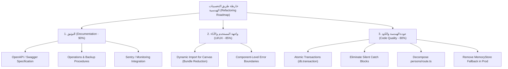

# 🚀 خارطة طريق التحسينات البرمجية والهندسية (Post-Testing Refactoring & Architecture Roadmap)

- **اسم المنظومة**: شجرة العائلة الكبرى (Family Tree Platform)
- **إصدار التقييم**: v1.0.0 (Post-Testing Quality Review)
- **الهدف**: توثيق النواقص الفنية والمجالات المتبقية للتحسين (Technical Debt) وتحويلها إلى خطة عمل مرحلية للارتقاء بالجودة الهندسية بعد نجاح كافة اختبارات التشغيل بنسبة 100%.
- **مسار الملف في المشروع**: [Post-Testing-Refactoring-Roadmap.md](file:///c:/Users/ASUS/Documents/Drive%20D/my%20apps%20and%20programs/FamilyTree/docs/Post-Testing-Refactoring-Roadmap.md)

---

## 📑 1. تقييم محاور التطبيق والنواقص الفنية المحددة

---

## 📋 2. تفاصيل التقييم والنواقص لكل محور

### 1️⃣ محور التوثيق (Documentation — 90%)
- **التقييم الفني**: وجود كافة اختبارات الـ API بنجاح لا يغني عن التوثيق البرمجي الموحد لتسهيل التوسع المستقبلي.
- **النواقص والمجالات المتبقية**:
  - **OpenAPI / Swagger**: غياب التوثيق البرمجي الموحد لتسهيل ربط التطبيق لاحقاً بتطبيقات الموبايل (iOS/Android). *(تم توفيره في `OpenAPI-Specification.md`)*.
  - **أدلة الصيانة التشغيلية**: توثيق إجراءات النسخ الاحتياطي التلقائي واستعادة البيانات عند الطوارئ. *(تم توفيره في `Operations-and-Backup-Guide.md`)*.
  - **أنظمة المراقبة والمتابعة**: توثيق ربط التطبيق المباشر ببيئات تتبع الأخطاء مثل (Sentry) وقياس الأداء المباشر. *(تم توفيره في `Monitoring-and-Observability-Guide.md`)*.

---

### 2️⃣ محور واجهة المستخدم والتعافي (UI/UX & Performance — 85%)
- **التقييم الفني**: واجهات تفاعلية قوية ولكن تحتاج إلى تحسين زمن التحميل الأولي وزيادة عزل الأخطاء.
- **النواقص والمجالات المتبقية**:
  - **حجم حزمة الجافاسكريبت (Bundle Size)**: يبلغ حجم التحميل الأولي لصفحة الشجرة الكبرى (281 KB) نتيجة الاعتماد على مكتبة الرسم التفاعلي React Flow.
    - *الحل المقترح*: استخدام الفصل الديناميكي `next/dynamic` للكانفاس لئلا يؤثر على سرعة التحميل الأولي.
  - **حواجز الأخطاء الدقيقة (Component-Level Error Boundaries)**: يقتصر التطبيق حالياً على شاشات تعافي عامة على مستوى المسارات (`error.tsx`).
    - *الحل المقترح*: إنشاء حواجز أخطاء مخصصة ومفصلة على مستوى المكونات والبطاقات المنفردة لضمان عدم انهيار الصفحة كاملة إذا حدث خطأ غير متوقع في فرد واحد.

---

### 3️⃣ محور جودة الهندسة البرمجية (Code Quality — 80%)
- **التقييم الفني**: هذا المحور يمثل **الدَين الفني (Technical Debt)** الأكثر تأثيراً على مستقبل الصيانة.
- **النواقص والمشاكل البرمجية المحددة**:
  1. **غيب المعاملات المترابطة (CQ-5 - Atomic Transactions)**: عدم استخدام `db.transaction()` في العمليات المركبة (مثل إضافة الأبناء وتوليد الوالد التلقائي Sibling Bridging).
     - *المخاطر*: قد يترك أفراداً أو روابط معلقة (Orphaned Nodes) إذا حدث خلل في منتصف التنفيذ.
  2. **كتل catch الصامتة (CQ-1)**: رصد كتل `catch {}` فارغة تمنع تسجيل الأخطاء (Logging) وتصعّب تتبع المشاكل في بيئة الإنتاج.
  3. **تضخم ملفات المسارات (CQ-3 - Bloated Routes)**: يحتوي ملف `persons/route.ts` على 691 سطر كود و 3 دوال معقدة.
     - *الحل المقترح*: تفكيك المسار إلى خدمات منطقية أصغر (Service Controllers & Helpers).
  4. **تكرار كود تحويل البيانات (CQ-2 - Duplicate Data Mappers)**: تكرار كود تحويل صفوف قاعدة البيانات إلى كائنات TypeScript في عدة مواضع بدون دالة تحويل مركزية (Central Mapper).
  5. **تعقيد التخزين المزدوج (CQ-4 - Dual Storage Complexity)**: آلية التراجع لـ `MemoryStore` في حال فشل PostgreSQL تضاعف مسارات التنفيذ وتزيد التعقيد بدون حاجة فعلية في بيئة الإنتاج.
  6. **غياب نظام السجلات الاحترافي (CQ-6 - Structured Logging)**: الاعتماد على `console.error` و `console.log` بدلاً من مكتبة تسجيل نظامية مبوبة مثل (Pino أو Winston).

---

## 🎯 3. خارطة طريق ترتيب الأولويات للتطوير القادم (Prioritized Action Plan)

### 🚨 أولوية حارجة (Critical Priority)
1. **تطبيق `db.transaction()`**: إدراج المعاملات الذرية في كافة عمليات قاعدة البيانات المركبة للوقاية من تلوث البيانات.
2. **معالجة كتل `catch {}` الصامتة**: استبدال الكتل الفارغة بسجلات صريحة ونظامية ترفع الاستثناءات وتمنع إخفاء الأخطاء.

### ⚠️ أولوية متوسطة (Medium Priority)
3. **تفكيك مسار `persons/route.ts`**: تقسيم الكود لملفات فرعية تزيد من قابلية الاختبار والاستدامة.
4. **تأسيس دالة تحويل مركزية (Central Mapper)**: توحيد تحويل صفوف قواعد البيانات إلى نماذج TypeScript المعتمدة.
5. **إلغاء `MemoryStore Fallback` في بيئة الإنتاج**: الاعتماد المباشر الصارم على PostgreSQL لتبسيط المسارات.

### 🔹 أولوية تحسينية وتكملية (Low / Enhancement)
6. **فصل مكتبة React Flow ديناميكياً (`next/dynamic`)**: لتقليل حجم الحزمة الأولية لصفحة الشجرة الكبرى.
7. **إضافة Error Boundaries على مستوى المكونات**: لعزل أي خطأ استثنائي في بطاقة الفرد دون تأثر باقي الكانفاس.
8. **ترقية السجلات إلى `Pino / Winston`**: لتخزين مخرجات النظام بصيغة JSON قابلة للبحث والتحليل في بيئات المراقبة.
